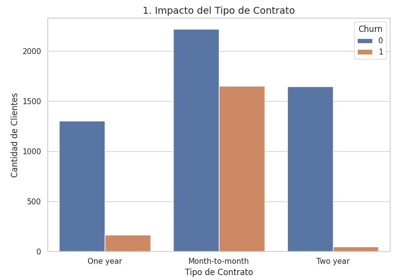
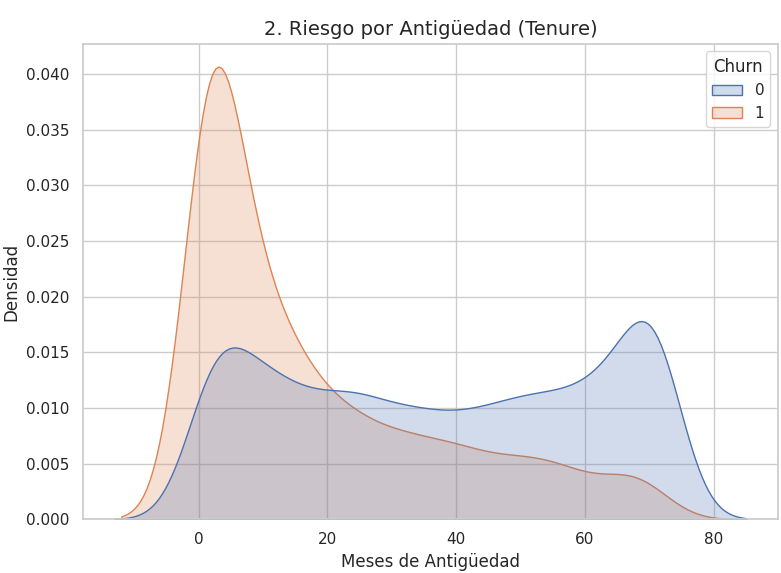
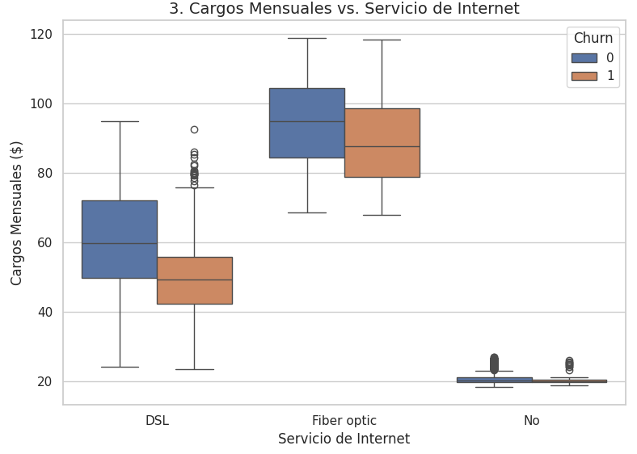
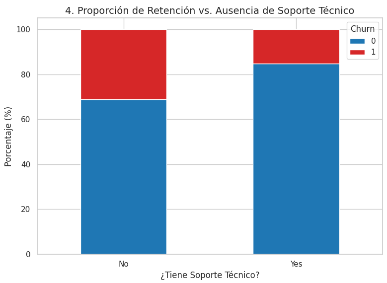

# 📊 TELECOMX 2: Análisis y Predicción de Clientes (Churn)

## 🎯 Objetivo del Proyecto
Telecom X enfrenta una alta tasa de cancelaciones de clientes (churn), lo que representa una pérdida significativa de ingresos y participación de mercado. Este proyecto contiene un flujo completo de Ciencia de Datos diseñado para predecir la probabilidad de que un cliente cancele sus servicios (Churn). A través del análisis exploratorio y el entrenamiento de modelos de Machine Learning, identificamos los factores críticos de retención para la toma de decisiones estratégicas.

---

## ⚙️ Preparación y Limpieza de Datos
El dataset original (datos_tratados.csv) fue procesado para optimizar el rendimiento de los algoritmos:
* **Selección de Características:** Se eliminaron identificadores y campos redundantes (CustomerID, ChargesDaily, ChargesTotal).
* **Estandarización:** Se unificó la categoría `"No internet service"` a `"No"` en servicios dependientes (Seguridad, Backup, Soporte Técnico, etc.).
* **Codificación:** Transformación de la variable objetivo `Churn` a formato binario (1/0) y aplicación de *One-Hot Encoding* para variables categóricas.
* **Escalado:** Normalización de variables continuas (Tenure, ChargesMonthly) mediante `StandardScaler`.

---

## 🤖 Modelos Evaluados

Se entrenaron y compararon dos modelos de clasificación, ajustando los pesos (class_weight=balanced) para mitigar el desbalanceo natural de las clases (73% Retenidos vs. 27% Cancelaciones).

1. **Regresión Logística:** Utilizado como modelo base (baseline) por su alta interpretabilidad.
2. **Random Forest Classifier:** Seleccionado por su capacidad para capturar relaciones no lineales y generar un ranking de importancia de variables.

---

## 📈 Conclusiones Estratégicas y Visualizaciones

El análisis revela 4 factores principales que impulsan la cancelación del servicio:

### 1. El Riesgo de la Ausencia de Compromiso (Tipo de Contrato)
Los clientes con contratos mes a mes presentan una tasa de cancelación drásticamente superior. La falta de barreras de salida facilita la migración a la competencia.

### 2. La Criticidad de los Primeros Meses (Antigüedad / Tenure)
El riesgo de abandono es agudo durante el primer año. Retener a un cliente más allá del mes 20 reduce exponencialmente la probabilidad de que cancele.

### 3. Sensibilidad al Precio en Servicios Premium
Contrario a la intuición, los usuarios del servicio de Fibra Óptica tienen mayores tasas de cancelación que los de DSL. Esto está fuertemente ligado a los cargos mensuales más altos, lo que incrementa la expectativa del cliente frente al valor recibido.

### 4. El Valor del Ecosistema de Soporte
La carencia de servicios de valor añadido, específicamente el **Soporte Técnico**, aumenta considerablemente la vulnerabilidad de la retención.

---

## 💡 Recomendaciones de Negocio
* **Campañas de Migración:** Incentivar el paso de contratos mensuales a anuales mediante descuentos en la tarifa base.
* **Onboarding Proactivo:** Implementar un seguimiento riguroso del servicio al cliente durante los primeros 6 meses (zona de alto riesgo de churn).
* **Empaquetamiento Estratégico (Bundling):** Incluir soporte técnico gratuito o a muy bajo costo durante el primer año para fidelizar al usuario dentro del ecosistema.

---
